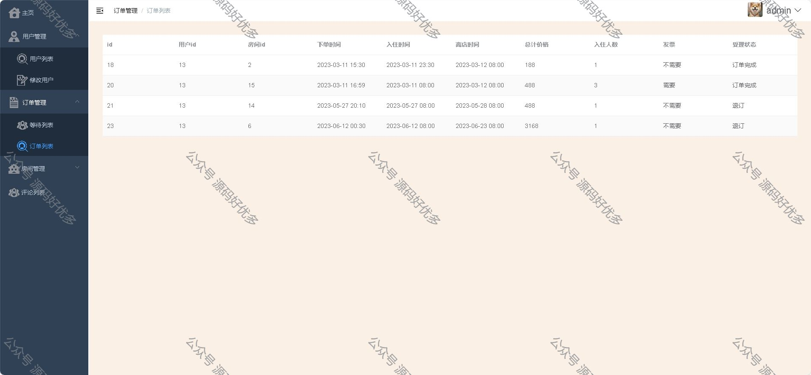
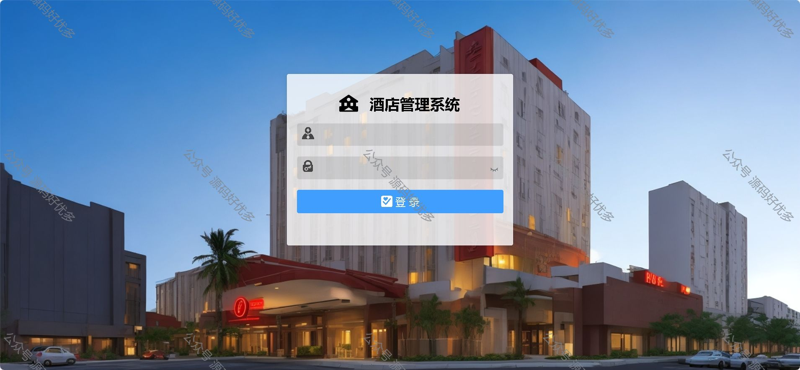
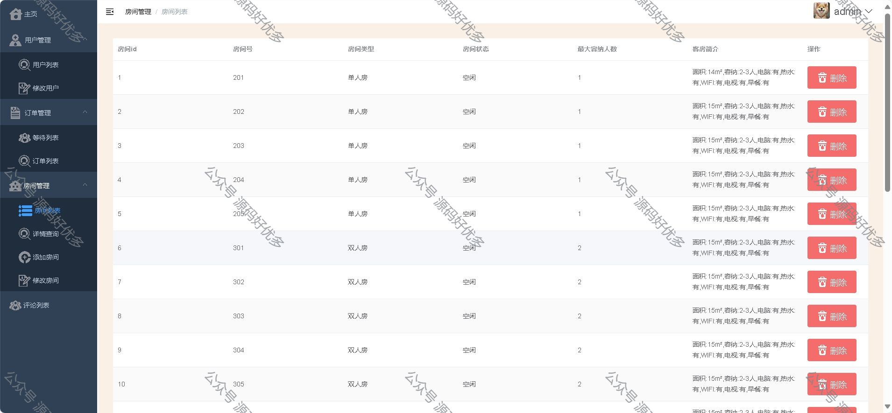
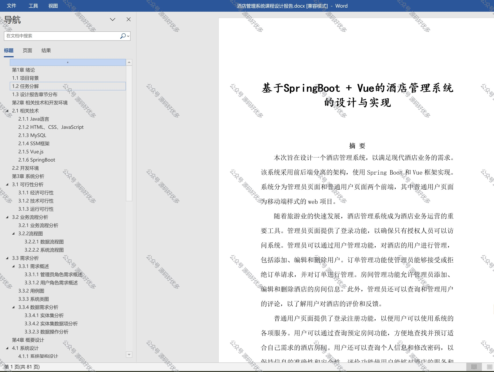
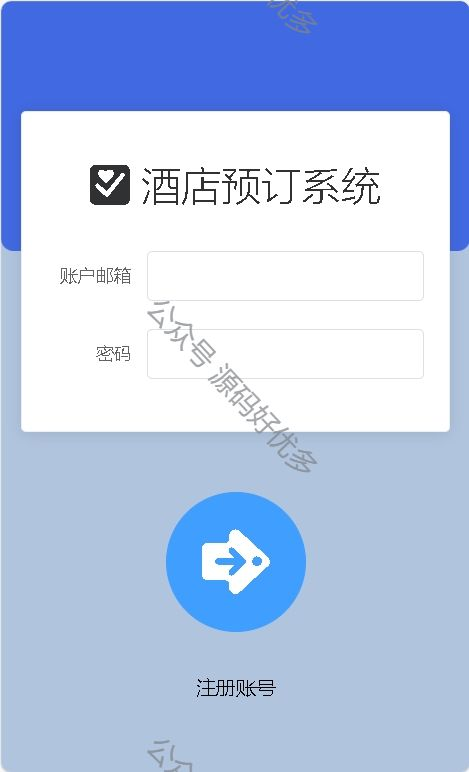
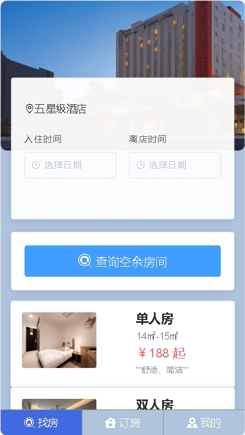
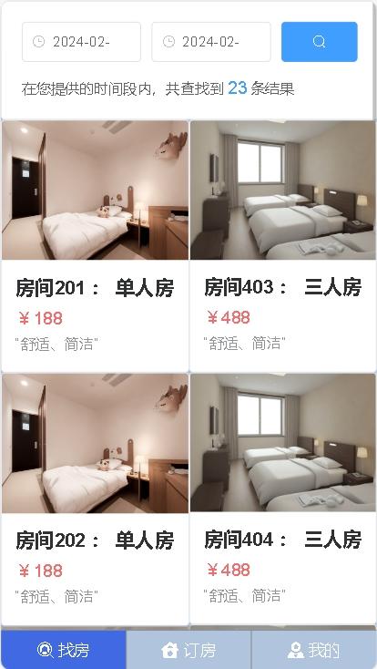
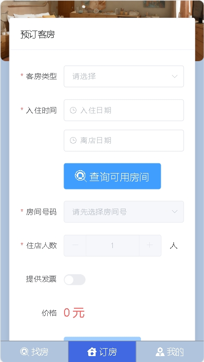
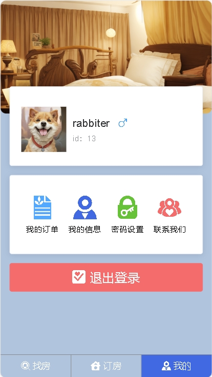
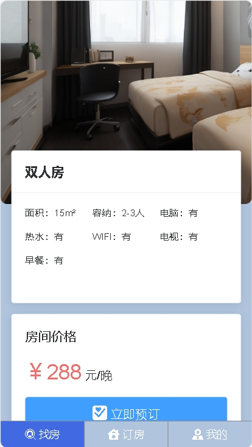

 
## 查看主页获取源码

> **作者介绍**： **✌**全网粉丝10W+本平台特邀作者、博客专家、CSDN新星计划导师、软件领域优质创作者,博客之星、掘金/华为云/阿里云/InfoQ等平台优质作者、专注于项目实战 **✌**

  

### 一、作品包含

源码+数据库+设计文档万字+全套环境和工具资源+部署教程

### 二、项目技术

前端技术：Html、Css、Js、Vue、Element-ui

数据库：MySQL

后端技术：Java、Spring Boot、MyBatis

  

### 三、运行环境

开发工具：IDEA/eclipse

数据库：MySQL8.0

数据库管理工具：Navicat10以上版本

环境配置软件： JDK1.8+Maven3.6.3

前端Nodejs：16

  

### 四、项目介绍
项目编号：springbootA016
1、酒店管理员功能：
登录：管理员可以通过登录功能进入系统，确保只有授权人员可以访问系统。
用户管理：管理员可以添加、编辑和删除酒店的用户，包括前台员工、服务员等。他们可以分配不同的权限和角色，管理员可以控制他们的访问和操作范围。
订单管理：管理员可以接受或拒绝订单请求，并对订单进行管理。他们可以查看订单详情，修改订单状态（如确认入住、取消预订等），并与客户进行沟通和协调。
房间管理：管理员可以添加、编辑和删除酒店的房间信息。他们可以设置房间的类型、价格、可用性等，并确保房间信息的准确性和更新。
评论管理：管理员可以查询和管理用户的评论。他们可以查看用户对酒店的评价和反馈，可以回复用户的评论，解决问题或提供帮助。

2、普通用户功能：
注册：用户可以通过注册功能创建自己的账户，以便使用系统的各项服务。
登录：用户可以使用注册时创建的账户登录系统，以便访问个人信息和使用其他功能。
查询预定房间：用户可以搜索和查看酒店的房间信息，包括房间类型、价格、可用性等，并进行预订。
查看个人信息和修改密码：用户可以查看自己的个人信息和修改登录密码，以保持信息的安全性。
评价酒店：用户可以对酒店进行评价和打分，分享自己的体验和意见，帮助其他用户做出选择。

### 五、运行截图

